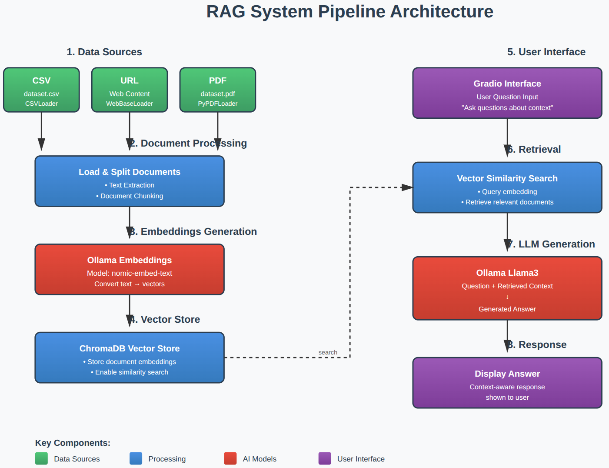

# Recipe RAG (Ollama + LangChain + Chroma + Gradio)

Small **Retrieval-Augmented Generation (RAG)** demo for recipe-related Q&A.  
It loads a knowledge source (currently a **CSV**), creates embeddings with **Ollama**, stores vectors in **Chroma**, retrieves the most relevant chunks for a user question, and generates an answer with **Llama 3** via **Ollama**, exposed through a simple **Gradio** UI.

## Tech
- Ollama (LLM inference + embeddings)
- LangChain (loaders + retriever abstraction)
- Chroma (vector store)
- Gradio (web UI)

## How it works (high level)
1. Load documents from `dataset.csv` (CSVLoader)
2. Embed chunks with `nomic-embed-text`
3. Store embeddings in Chroma and retrieve relevant chunks for a query
4. Send *Question + Retrieved Context* to `llama3`
5. Display the answer in a Gradio interface

## Requirements
- Python packages: `gradio`, `langchain`, `langchain-community`, `chromadb`, `ollama`
- Ollama running locally with:
  - `llama3` (LLM)
  - `nomic-embed-text` (embeddings)

## Run
1. Put your knowledge base in `dataset.csv` (or update the path in the script).
2. Start Ollama.
3. Run the script:
   ```bash
   python app.py
